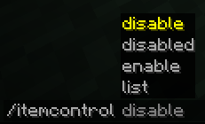
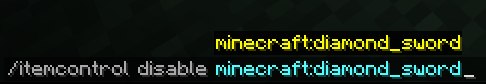
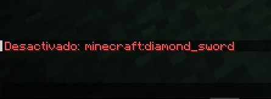

# ItemControl - Gestor de Items para Minecraft

[](LICENSE)


Un mod que permite controlar qué items pueden ser crafteados o usados por los jugadores.

## ✨ Características

- **Bloqueo de items**:
    - Impide el crafteo de items desactivados
    - Cierra automáticamente la mesa de crafteo al intentar crear items prohibidos
    - Elimina items desactivados encontrados en inventarios

- **Sistema de comandos**:
    - `/itemcontrol disable <item>` - Desactiva un item
    - `/itemcontrol enable <item>` - Reactiva un item
    - `/itemcontrol disabled` - Lista items desactivados
    - Autocompletado inteligente con sugerencias

- **Persistencia**:
    - Configuración guardada en `config/items_control.json`
    - Soporte para reload sin reiniciar el servidor

## 📦 Requisitos

- Minecraft 1.21.4
- Fabric Loader
- Fabric API


## 🛠 Uso básico

1. **Desactivar un item**:
    ```bash
    /itemcontrol disable minecraft:diamond_sword
2. **Ver Items desactivados**
    ```bash
    /itemcontrol disabled
3. **Activar nuevamente el item**
    ```bash
    /itemcontrol enable minecraft:diamond_sword
4. **Ver Lista de Items Crafteables** (No funca, muestra todo los items)
    ```bash
    /itemcontrol list

## 📝 Configuración avanzada
Edita manualmente config/items_control.json para:

- Agregar/Borrar items a la lista

Ejemplo de estructura:

    [
        "minecraft:netherite_axe",
        "minecraft:elytra"
    ]

## 🎨 Capturas




